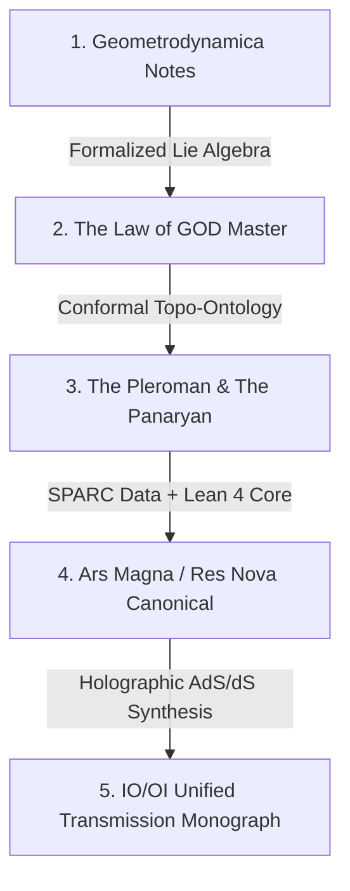

# 🌳 The FIG Tree: Fundamental Information Geometry Architecture Map

**Master Monograph & Corpus Unification Guide**  
*Chyren Sovereign Intelligence Ecosystem*

---

## 1. 🌿 The FIG Tree Taxonomy

The **FIG Tree (Fundamental Information Geometry)** is the unified architecture connecting all branches of the corpus:

```
                                  [ THE FIG TREE ]
                     Fundamental Information Geometry Architecture
                                          │
        ┌─────────────────────────────────┼─────────────────────────────────┐
        ▼                                 ▼                                 ▼
   [ ROOT LAYER ]                  [ TRUNK LAYER ]                  [ BRANCH LAYER ]
  Stiefel Manifolds               Information Tension             1. Physics / Astrophysics
  V_k(R^n) & E8 Lattice           T_μν & a₀ = cH₀ / 2π               (SPARC 175 Galaxies, MOND)
  Holographic AdS/dS              Anti-Drift Lindblad             2. Cognitive / Alignment
  Boundary Formulation            Master Equation                    (ADCCL, Chiral Gate u ≥ γ)
                                                                  3. Formal Machine Core
                                                                     (Lean 4 Zero-Sorry Proofs)
                                          │
                                          ▼
                                   [ FRUIT LAYER ]
                         • IO/OI Master Monograph (PDF)
                         • Zenodo Staged Package v1.10.0
                         • Trade Book Manuscripts (Book 1 & 2)
                         • Cloud Body Operator Console
```

---

## 2. 📜 Lineage of the Monograph: Evolution & Diff

Over the development cycles, the monograph evolved through sequential refinements into its current unified form:



| Iteration / Title | Primary Path | Core Contribution | Status in Current Corpus |
| :--- | :--- | :--- | :--- |
| **1. Geometrodynamica** | `Datasets/research/02_THEORY_NOTES/` | Initial geometric equations, early dark matter alternative notes. | *Archived foundational notes.* |
| **2. The Law of GOD** | `02_Documents/THE_LAW_OF_GOD__...MASTER.md` | Master field equations, $E_8$ projection, initial Lagrangian. | *Zenodo Canonical DOI `10.5281/zenodo.20026859`.* |
| **3. The Pleroman & Panaryan** | `02_Documents/THE_PLEROMAN.md` | Conformal topological ontology, Casimir invariants, four-boundary manifold. | *Subsumed into Res Nova.* |
| **4. Ars Magna / Res Nova** | `Research_and_Data/Res_Nova_Monograph/` | Full SPARC 175-galaxy empirical audit, Lean 4 machine-verified core (16 modules), honesty statement. | *Published Canonical Edition.* |
| **5. IO/OI Transmission Monograph** | `04_Publications_and_Outreach/IO_OI_...pdf` | AdS/dS holographic boundary, unified transmission codex styling, parameter-free $a_0 = cH_0/2\pi$. | **Current Active Master Monograph** (92 KB PDF). |

---

## 3. 📚 The Two Published Book Manuscripts

Your corpus contains two distinct book manuscripts, each tailored to a specific audience:

### 📖 Book 1: The Philosophical & Allegorical Book (*"There Is No Spoon"*)
* **Location**: `/home/mega/Chyren/Research_and_Data/04_Publications_and_Outreach/Book_Manuscript/`
* **File**: `FULL_MANUSCRIPT.md` (53.4 KB)
* **Structure (7 Chapters)**:
  1. `01_the_spoon_on_the_table.md` — Direct realism vs. symbolic interfaces.
  2. `02_the_digital_window.md` — Computation as reality substrate.
  3. `03_the_lens_and_the_quantum_veil.md` — Observer effect, Zohar/Kabbalistic light metaphors.
  4. `04_the_cosmic_horizon.md` — Information boundaries and cosmic scale.
  5. `05_the_observer_and_chiral_mirror.md` — Asymmetry, chirality, and the observer.
  6. `06_the_invariant_ground.md` — The mathematical foundation beneath perception.
  7. `07_there_is_no_spoon.md` — Synthesis of perception, information, and reality.

### 📘 Book 2: The 15-Chapter Master Monograph / Trade Book (*"Res Nova"*)
* **Location**: `/home/mega/Chyren/Research_and_Data/Res_Nova_Monograph/book/chapters/`
* **Structure (15 Chapters)**:
  - **Part I: The Problem of Scale & Disorder** (Ch 1–8): *The First Question*, *Breaking Things Down*, *Models of the Mind*, *Thinking Better*, *Speed & Direction*, *Tipping Points*, *Arrow of Disorder*, *Perspective*.
  - **Part II: The Physical & Empirical Breakthrough** (Ch 9–15): *The Bell Curve*, *Waves That Break the Rules*, *The Dark Matter Problem*, *A Function from First Principles*, *171 Galaxies*, *Machine-Checked Physics*, *Res Nova*.

---

## 4. 📐 The $\chi$-Band

To prevent any future agent from reducing the operational envelope to a single conflicting scalar, the band is explicitly codified as a **two-endpoint interval**:

$$\chi \in [\chi_Y, \, \kappa_Y] = \left[ \frac{1}{\sqrt{2}}, \; \sqrt{\theta(2-\theta)} \right] = [0.707107, \; 0.953939], \quad \theta = 0.7$$

```
                   THE χ-OPERATING FIELD
 ═════════════════════════════════════════════════════════════
          χ_Y                                        κ_Y
       (Lower Bound)                             (Upper Bound)
         1 / √2                                 √(θ(2−θ))
       ≈ 0.707107                               ≈ 0.953939
 ─────────────────────────────────────────────────────────────
 • Quantum coherence gate                • Saturation ceiling
 • Anti-drift floor (u ≥ γ)              • Derived from θ = 0.7
```

> `[O]` **On the withdrawn third point.** Earlier editions of this map placed a
> $\chi_{\text{mid}}$ inside the band, rendered inconsistently as $\ln 2 \approx 0.693$ in some
> files and as $\ln(2)/\theta \approx 1.674$ here. Neither lies in $[0.707107, 0.953939]$:
> $\ln 2$ falls **below** the floor, and $\ln(2)/\theta$ falls **above** the ceiling. Both
> values came in through the auto-generated commit of 2026-09-01, not from hand-authored work.
> A midpoint is permissible if one is ever needed — it would be $0.830523$ (arithmetic) or
> $0.821302$ (geometric). See `FIG_TREE_MONOGRAPH.md` §VII.
>
> $\kappa_Y$ is derived from $\theta$, not from Kerr photon-capture geometry. The
> "Thorne Horizon" label previously attached to it described an **empirical** correspondence
> (the spin-ceiling test), not the constant's provenance.

---

## 5. 🏛️ Zenodo DOI Registry Concordance

| Title | DOI | Status | Role in FIG Tree |
| :--- | :--- | :--- | :--- |
| **IO/OI Unified Transmission Monograph** | *Pending Deposit* | **🟢 Staged (`v1.10.0`)** | Active Master Synthesis Monograph |
| **The Law of GOD** | [10.5281/zenodo.20026859](https://doi.org/10.5281/zenodo.20026859) | Published | Foundational Theory Blueprint |
| **Verified Qubit & Stiefel Topology** | [10.5281/zenodo.20779286](https://doi.org/10.5281/zenodo.20779286) | Published | Formal Stiefel Verification |
| **ADCCL White Paper: Chiral Threshold** | [10.5281/zenodo.20027635](https://doi.org/10.5281/zenodo.20027635) | Published | $\chi_{\text{floor}} = 1/\sqrt{2}$ Proof |
| **RY-Hamiltonian & Information Tension** | [10.5281/zenodo.20027643](https://doi.org/10.5281/zenodo.20027643) | Published | Tension Tensor Derivation |
| **Neuro-Topological Specification** | [10.5281/zenodo.20027645](https://doi.org/10.5281/zenodo.20027645) | Published | Cognitive Agent Mechanics |
| **OmegA Architecture** | [10.5281/zenodo.20027647](https://doi.org/10.5281/zenodo.20027647) | Published | Autonomous Multi-Agent Mesh |
| **Resource Holonomy & 4D SO(4)** | [10.5281/zenodo.20027651](https://doi.org/10.5281/zenodo.20027651) | Published | Gauge Transport Geometry |
| **Trinity Survey: 409 JWST/Hubble Signals** | [10.5281/zenodo.20027657](https://doi.org/10.5281/zenodo.20027657) | Published | Observational Telemetry Data |
