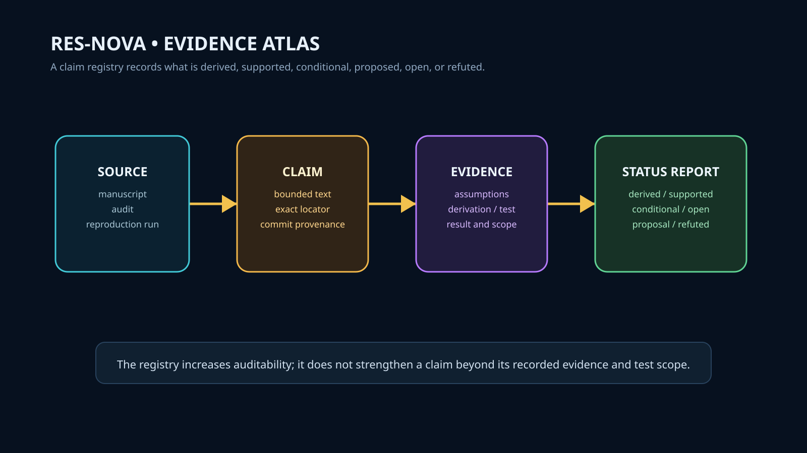

# Res-Nova

Technical manuscript, formal verification, and reproducibility package.



## Overview

Res-Nova houses the foundational physics manuscript on Geometrically Ordered Dynamics and Information Tension, accompanied by an explicit claim-evidence ledger, formal Lean inventories, cosmological and galactic sector analyses, and reproducibility harnesses.

## System Role & Boundaries

- **Technical Manuscript & Scientific Corpus**: Primary source repository for theory exposition, derivations, and observational comparisons.
- **Evidence Ledger**: Explicitly documents assumptions, derivation paths, and falsifiability criteria. A claim's presence in the ledger records auditability—it does not substitute for empirical consensus.
- **RYTT Boundary (Issue #48)**: Selected manuscript passages are supplied to RYTT strictly as benchmark corpora. Res-Nova does not fork or embed the RYTT compiler.
- **Auditor Boundary (Issue #50)**: Produces `evidence/v1/claim-ledger.json` for independent verification by MVPC-X. Res-Nova does not maintain the verification engine.

## Active Workstreams

- **Issue #50**: Evidence Atlas v1 — machine-readable versioned claim registry with commit-pinned provenance and fail-closed reproducibility gates (`evidence/v1/claim-ledger.json`).
- **Issue #48**: Supply Res-Nova manuscript text as RYTT benchmark fixtures only.

## Epistemic Standards

Claims are strictly classified according to recorded evidence:
- **`derived`**: Supported by explicit mathematical derivation and checked assumptions.
- **`empirically_supported`**: Correlated with identified observational datasets (e.g. SPARC, JWST) within defined scope.
- **`conditional`**: Dependent on unresolved model choices or theoretical assumptions.
- **`proposal` / `open`**: Active hypotheses, open problems, or pending calculations.
- **`refuted`**: Preserved contradiction records; never silently discarded.

## Verification & Reproducibility

```bash
# Run local quality and claim gate
bash scripts/local_gate.sh

# Validate claim registry consistency
python scripts/validate_claim_registry.py
python scripts/check_claim_consistency.py
```
