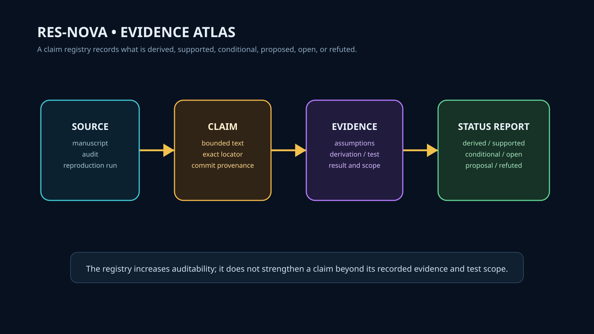

# Res-Nova

<p align="left">
  <a href="https://github.com/Mega-Therion/Res-Nova/actions/workflows/verify.yml"></a>
  <a href="https://github.com/Mega-Therion/Res-Nova/actions/workflows/verify.yml"></a>
  <a href="https://doi.org/10.5281/zenodo.21539453"></a>
  <a href="https://res-nova-atlas.vercel.app"></a>
  <a href="https://huggingface.co/datasets/ChyRho/res-nova"></a>
  <a href="https://orcid.org/0009-0001-1303-7190"></a>
  <a href="https://www.linkedin.com/in/r-w-yett/"></a>
  <a href="https://x.com/_chyrho_"></a>
</p>

Technical manuscript, formal verification, and reproducibility package.

## For reviewers — start here

| | |
| :--- | :--- |
| [`CURRENT_STATE_READ_THIS_FIRST.md`](CURRENT_STATE_READ_THIS_FIRST.md) | The current status of every physics claim. Its verification date is enforced by CI against the newest physics change. |
| [`PEER_REVIEW_READINESS.md`](PEER_REVIEW_READINESS.md) | The twelve research targets, each scored and decomposed. |
| [`docs/EPISTEMIC_TIER_LEGEND.md`](docs/EPISTEMIC_TIER_LEGEND.md) | The canonical claim tags. Where any other legend disagrees, this one wins. |
| [`FOR_REFEREES.md`](FOR_REFEREES.md) | Referee-facing notes. |
| [`05_lean_formalization/verify_all_proofs.sh`](05_lean_formalization/verify_all_proofs.sh) | The Lean 4 gate. 66/66 targets passed locally on 2026-10-03: no `sorry`, standard axioms only. |
| [`assurance/claims.json`](assurance/claims.json) | The machine-readable claim registry, gated in CI. |
| [`research-hub/`](research-hub/) | Source for the Research Atlas web app, merged here 2026-10-03 from the former `res-nova-research-hub` repository. |

## What this repository is — and is not

Res-Nova is the only public home of claims about the physical world. Notes in Chyren stay in the workshop until they name a catalog, a measurement, or a physical model and are promoted here. Nova-Conscientia may borrow a formula as code. That borrowing is not a result of this repository. See [`docs/REPO_PROMOTION.md`](docs/REPO_PROMOTION.md).

Res-Nova is a research program in modified gravity built to be checked:
- It tests a MOND-type interpolating law and its covariant completion (Skordis–Złośnik AeST) against real catalogs. These are SPARC (171 galaxies, 3375 points), the RC100 and MUSE-DARK III high-redshift samples, and Cassini's external-field bound (which unscreened μ_std fails; see below).
- It records what the data reject as well as what survives.
- It machine-checks the mathematics in Lean 4.

**What is proved.** `[P]` means a machine-checked theorem. It certifies mathematics, never physical ontology. Examples are c_T = c (D8) and the μ_std embedding in AeST (D9).

**What was killed.** Each `[X]` is kept with its date:
- μ = x/(1+x), which fails in the solar system (2026-09-12);
- the 20-point high-z table, with its 5.9σ and 2.06σ results (2026-09-27);
- lepton and quark mass "predictions". The Lean modules fit measured masses; they do not predict them. The ledger was corrected and status notices were added to the legacy manuscripts on 2026-10-03. `ARS_MAGNA_THE_LAW_OF_GOD` now lives in `archive/legacy_root/`. The Navier–Stokes notes live in the same directory. `05_lean_formalization/NavierStokesScope.lean` is an alignment-threshold lemma, not a regularity proof.

**What is open.** Each `[O]`:
- AeST branch selection (D7). A proposed no-go from an exploratory non-linear solver is **not adopted**.
- The 2π in the a₀ ≈ cH₀/2π anchor, which is declared, not proved.
- a₀(z), where the real high-z data are inconclusive.
- Non-linear structure formation.
- Solar-system screening. At the horizon-anchor a₀ (cH₀/2π), unscreened μ_std fails Cassini's external-field quadrupole (about 4.6σ, and +8.7σ against the 2026 bound). Only the phenomenological duality screening S = 1/(1+η²) passes Cassini, SPARC and the Milky Way dwarfs together. It has no covariant realization yet.

**What this is not.** It is not a claim to have overturned general relativity or ΛCDM. It is not parameter-free: it declares two irreducible inputs, the a₀ scale and the choice of interpolating function.

**How it polices itself.** CI fails on:
- an inconsistent claim registry;
- a retired construction reappearing on a live surface;
- a stale current-state file;
- a Lean target with a `sorry` or a non-standard axiom;
- a formal module cited by a manuscript with no stated physical meaning, or two modules claiming the same one.

Corrections are recorded with dates, never applied silently. Example: on 2026-10-03 a copy-paste defect was found in [`docs/grounding_ledger.yaml`](docs/grounding_ledger.yaml), where 59 modules shared one physical denotation. It was repaired from git history, and a check now fails the build if it recurs.

## How this was built

R.W. Yett directs the research. Much of the code and prose was written with AI coding assistants; those commits carry `Co-Authored-By` trailers. Claims rest on the scripts, data and Lean builds in this repository, not on model judgments. Some older documents are AI-generated self-assessments (a build "certificate", a manuscript verification report, a notation and peer-review report); they are kept under `archive/legacy_root/` as records of the process and are not evidence.

## AI Safety & Scalable Oversight Utility

Res-Nova is a live demonstration of *falsifiable, machine-checkable scientific claims*. Every quantitative result in the manuscript is registered in a structured claim registry (`scripts/validate_claim_registry.py`) and gated by a Lean 4 proof target inventory (`05_lean_formalization/`). The CI pipeline runs daily and on every push, executing:

- **Claim consistency checks** — automated detection of internal contradictions across the claim registry
- **Lean 4 formal gate** — `05_lean_formalization/verify_all_proofs.sh` builds every target and fails on any compiler-reported `sorry` or non-standard axiom; `lake build` alone is not the gate
- **MVPC-X conformance judgment** — an independent claim-consumer replays the rendered claim bundle against a formal judge, catching evaluator-gaming and vacuous proofs

This architecture is directly applicable to **scalable oversight** and **interpretability auditing**: the same claim-registry and formal-gate pattern can bound the behavior of AI systems whose outputs make mathematical or logical assertions. The reproducibility package (Zenodo DOI `10.5281/zenodo.21539453`) provides a self-contained, citable artifact for replication.

## Citation

**Canonical citation** — cite the concept DOI when you mean the work. It always
resolves to the newest version.

> Yett, R. W. (2026). *Res Nova: Geometrically Ordered Dynamics and Information
> Tension.* Zenodo. https://doi.org/10.5281/zenodo.21539453

| | |
| :--- | :--- |
| Author | R.W. Yett |
| ORCID | [0009-0001-1303-7190](https://orcid.org/0009-0001-1303-7190) |
| Repository | [Mega-Therion/Res-Nova](https://github.com/Mega-Therion/Res-Nova) |
| Concept DOI (always latest) | [10.5281/zenodo.21539453](https://doi.org/10.5281/zenodo.21539453) |
| Current version DOI | [10.5281/zenodo.22079177](https://doi.org/10.5281/zenodo.22079177) |
| Current repository tag | `v1.9.0` |

### Version history

Zenodo mints a separate DOI for each published version and links the lineage.
Earlier DOIs remain valid and resolvable; they are the historical record, not
errors. The version family under concept `10.5281/zenodo.21539453` is:

| Version DOI | Version | Date |
| :--- | :--- | :--- |
| [22079177](https://doi.org/10.5281/zenodo.22079177) | current | 2026-08-24 |
| [21660856](https://doi.org/10.5281/zenodo.21660856) | 5.0.0 | 2026-07-28 |
| [21623111](https://doi.org/10.5281/zenodo.21623111) | 4.0.0 | 2026-07-27 |
| [21583646](https://doi.org/10.5281/zenodo.21583646) | earlier | — |
| [21544746](https://doi.org/10.5281/zenodo.21544746) | earlier | — |
| [21539454](https://doi.org/10.5281/zenodo.21539454) | earlier | — |

### Release archives

The GitHub release archives are a **separate** lineage from the manuscript. They
record the state of this repository at a tag, not the text of the paper:

| | |
| :--- | :--- |
| Release concept DOI | [10.5281/zenodo.21969120](https://doi.org/10.5281/zenodo.21969120) |
| Latest archived release | [10.5281/zenodo.21969121](https://doi.org/10.5281/zenodo.21969121) (`v1.6.2`) |

The repository is currently at `v1.9.0`, so the newest tags are not yet archived.
Do not cite a release archive when you mean the paper.

The authoritative list of every DOI in this project is
[`docs/publication_registry.yaml`](docs/publication_registry.yaml), generated
from DataCite and enforced by
[`scripts/audit_publication_metadata.py`](scripts/audit_publication_metadata.py).



## Overview

Res-Nova houses the foundational physics manuscript on Geometrically Ordered Dynamics and Information Tension, accompanied by an explicit claim-evidence ledger, formal Lean inventories, cosmological and galactic sector analyses, and reproducibility harnesses.

## System Role & Boundaries

- **Technical Manuscript & Scientific Corpus**: Primary source repository for theory exposition, derivations, and observational comparisons.
- **Evidence Ledger**: Explicitly documents assumptions, derivation paths, and falsifiability criteria. A claim's presence in the ledger records auditability—it does not substitute for empirical consensus.
- **RYTT Boundary (Issue #48)**: Selected manuscript passages are supplied to RYTT strictly as benchmark corpora. Res-Nova does not fork or embed the RYTT compiler.
- **Auditor Boundary (Issue #50)**: Produces `evidence/v1/claim-ledger.json` for independent verification by MVPC-X. Res-Nova does not maintain the verification engine.

## Active Workstreams

- **Issue #50**: Evidence Atlas v1 — machine-readable versioned claim registry with commit-pinned provenance and fail-closed reproducibility gates (`evidence/v1/claim-ledger.json`).
- **Issue #48**: Supply Res-Nova manuscript text as RYTT benchmark fixtures only.

## Acceleration Scale

The working value, fitted over 171 SPARC galaxies / 3375 points under
`tau(g) = 1/2 + sqrt(1/4 + a0/g)` with per-galaxy published distance and
inclination errors (`02_galaxy_dynamics/A0_MEASUREMENT.json`):

`a0 = (1.116 \pm 0.128_{stat} \pm 0.097_{syst}) \times 10^{-10}\,\mathrm{m\,s^{-2}}` (14.4% total)

`a0` is an **empirical acceleration scale**. It is numerically close to `cH0/2pi`;
that closeness is an observation, **not** a derivation, and must not be quoted as one.

Under the same μ_std, the tier-0 median reduced χ² is 11.08 for that horizon anchor
and 9.93 for the literature value 1.2×10⁻¹⁰ m s⁻²
(`02_galaxy_dynamics/PARAMETER_LEDGER.json`, 3375 points). The horizon anchor fits
worse. At tier 1, with 374 shared nuisances free, the medians are 3.36 and 3.41
(`02_galaxy_dynamics/SPARC_TIER1_ANCHOR_COMPARISON.md`). The anchor is not
distinguished once those nuisances are free, and it is not ruled out.
The fixed point in that comparison is the galaxy scale. \(cH(z)\) is the
quantity that moves with expansion (`04_cosmology/GALAXY_ANCHOR_HORIZON.md`). Lean checks the algebra of what was encoded. It does not decide this
comparison. The cosmology tests so far are consistent, tied, or inconclusive.
None is a confirmed new prediction.

**SUPERSEDED** (do not quote as current): the earlier 176-parameter in-sample
headline `chi^2/N_g = 2.92` with `a0 = (9.433 \pm 0.050) \times 10^{-11}`. That error
bar treated 3391 radial points as independent, and the old 5-fold CV leaked a
single global `a0` into every test fold.

## Epistemic Standards

Claim tags follow [`docs/EPISTEMIC_TIER_LEGEND.md`](docs/EPISTEMIC_TIER_LEGEND.md), the canonical legend:

| tag | meaning |
| :-- | :-- |
| `[P]` | **Proved**: a Lean theorem, no `sorry`, standard axioms. Mathematics only. |
| `[D]` | **Derived** here by an explicit, checkable argument (not machine-checked). |
| `[E]` | **Empirical**: a measurement or comparison against a named dataset. |
| `[C]` | **Cited** from the published literature (DOI given). |
| `[conj]` | **Conjectured**: believed, not derived. |
| `[A]` | **Axiom**: assumed, with the reason stated. |
| `[O]` | **Open**: no result either way; what is missing is stated. |
| `[X]` | **Killed**: falsified, retracted or superseded, with date and reason. |

`[D*]`, `[P/O]` and `[arith]` are defined in the legend. A compound `[P/O]` must always say which part is which.

The machine-readable claim registry (`assurance/claims.json`) records each claim's state:
- **`derived`**: Supported by explicit mathematical derivation and checked assumptions.
- **`empirically_supported`**: Correlated with identified observational datasets (e.g. SPARC, JWST) within defined scope.
- **`conditional`**: Dependent on unresolved model choices or theoretical assumptions.
- **`proposal` / `open`**: Active hypotheses, open problems, or pending calculations.
- **`refuted`**: Preserved contradiction records; never silently discarded.

## Verification & Reproducibility

```bash
# Run local quality and claim gate
bash scripts/local_gate.sh

# Validate claim registry consistency
python scripts/validate_claim_registry.py
python scripts/check_claim_consistency.py
```
