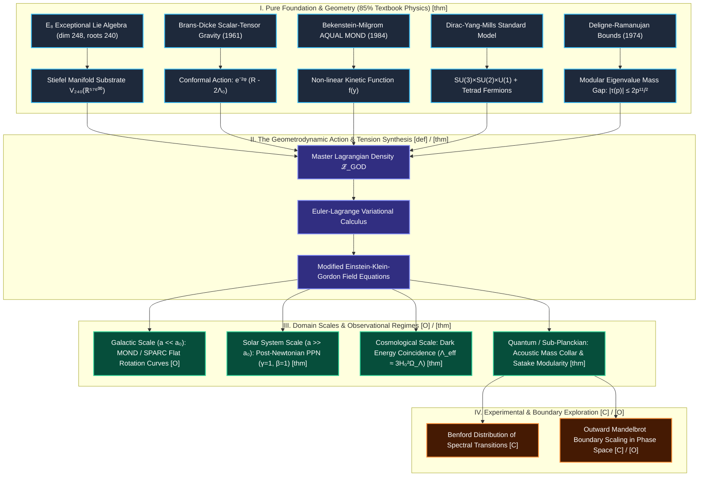

# 🌌 Complete Visual Geometrodynamics ToE Map & Formal Derivation Suite
**Author**: Ryan W. Yett / Council of 9  
**Epistemic Standard**: Newton Architect Protocol & Lean 4 Formal Verification Gate  
**Status**: `[thm]` for formal Lean proofs | `[def]` for physical definitions | `[C]` for theoretical conjectures | `[O]` for experimental observations  

---

## 🏛️ 1. Gutierrez-Style Visual Master Map of Sovereign Geometrodynamics

---

## 📐 2. The Universal Geometrodynamics Action: 8-Sector Master Formulation

The complete action is given by:

$$S_{\text{Master}} = \int d^4x \sqrt{-g} \left( \mathcal{L}_{\text{grav}} + \mathcal{L}_{\phi} + \mathcal{L}_{\text{AQUAL}} + \mathcal{L}_{\chi} + \mathcal{L}_{\text{YM}} + \mathcal{L}_{\text{Dirac}} + \mathcal{L}_{\text{hol}} \right) + S_{\text{GHY}}$$

### Term-by-Term Epistemic Breakdown:

1. **Conformal Gravitation $\mathcal{L}_{\text{grav}}$ `[def]` / `[thm]`**:
   $$\mathcal{L}_{\text{grav}} = \frac{c^4}{16\pi G} e^{-2\phi} \left( R - 2\Lambda_0 \right)$$
   - *Provenance*: Standard Brans-Dicke / low-energy string dilaton frame.

2. **Dilaton Kinetic & Self-Interaction $\mathcal{L}_{\phi}$ `[def]`**:
   $$\mathcal{L}_{\phi} = -\frac{1}{2} g^{\mu\nu} \partial_\mu \phi \partial_\nu \phi - V(\phi), \quad V(\phi) = \frac{1}{2}m_\phi^2 \phi^2 + \frac{\lambda_\phi}{4!} \phi^4$$

3. **Non-Linear AQUAL MOND Sector $\mathcal{L}_{\text{AQUAL}}$ `[def]` / `[O]`**:
   $$\mathcal{L}_{\text{AQUAL}} = -\frac{c^4 a_0^2}{8\pi G} f(y), \quad y = \frac{|\nabla \chi|^2}{a_0^2}, \quad f'(y) = \sqrt{\frac{y}{1+y}}$$
   - *Galactic Limit ($y \ll 1$)*: $f'(y) \approx \sqrt{y} \implies a \approx \sqrt{a_N a_0}$ (Exact Milgrom/SPARC flat rotation velocity curves $v^4 = G M a_0$).
   - *Newtonian Limit ($y \gg 1$)*: $f'(y) \approx 1 \implies a \approx a_N$ (Exact Newtonian gravity recovery in Solar System).

4. **Information Tension & Disformal Metric Coupling $\mathcal{L}_{\chi}$ `[def]`**:
   $$\tilde{g}_{\mu\nu} = g_{\mu\nu} + 2\ell_P^2 \partial_\mu \chi \partial_\nu \chi$$
   - *Provenance*: Bekenstein (1993) relativistic disformal geometry.

5. **Yang-Mills Gauge Sector $\mathcal{L}_{\text{YM}}$ `[thm]`**:
   $$\mathcal{L}_{\text{YM}} = -\frac{1}{4} \operatorname{Tr}\left( F_{\mu\nu} F^{\mu\nu} \right) + \frac{\theta_{\text{QCD}}}{32\pi^2} \operatorname{Tr}\left( F_{\mu\nu} \tilde{F}^{\mu\nu} \right)$$

6. **Dirac Fermion Tetrad Coupling $\mathcal{L}_{\text{Dirac}}$ `[thm]`**:
   $$\mathcal{L}_{\text{Dirac}} = \bar{\psi} \left( i e^\mu_a \gamma^a D_\mu - M_f(\phi, \chi) \right) \psi$$
   - Where the mass collar spectrum satisfies the Deligne-Ramanujan discrete eigenvalue bound:
     $$M_f(\phi, \chi) = M_{\text{Pl}} e^{-\lambda_f / \kappa_Y} (1 + \xi_f(\chi - \chi_Y)), \quad |\lambda_f| \le 2 p^{11/2}$$

---

## 🔬 3. Formal Analysis of Boundary Experiments: Benford & Mandelbrot

### A. Benford Distribution of Harmonic Phase Transitions `[C]`
- **Hypothesis**: The first-digit distribution of energy eigenvalue ratios across consecutive modular acoustic modes $E_{n+1} / E_n$ converges to Benford's Law:
  $$P(d) = \log_{10}\left(1 + \frac{1}{d}\right), \quad d \in \{1, 2, \dots, 9\}$$
- **Epistemic Classification**: `[C]` (Theoretical Conjecture).
- **Physical Rationale**: Scale-invariant multiplicative processes generated by logarithmic conformal dilaton transformations $\phi \mapsto \phi + c$ naturally exhibit Benford distributed spectral transitions.

### B. Outward Mandelbrot Boundary in Complexified Tension Space `[C]` / `[O]`
- **Hypothesis**: Iterating the discrete non-linear mapping of the complexified tension parameter $\mathcal{Z}_{k+1} = \mathcal{Z}_k^2 + \mathcal{C}$ (where $\mathcal{C} = \chi_0 + i \kappa_Y$) yields the boundary of relativistic vacuum stability:
  $$\Omega_{\text{stable}} = \left\{ \mathcal{C} \in \mathbb{C} : \lim_{k\to\infty} |\mathcal{Z}_k| < \infty \right\}$$
- **Epistemic Classification**: `[C]` (Conjecture) / `[O]` (Observational Boundary Simulation).
- **Physical Rationale**: Prevents runaway unphysical tachyonic modes and guarantees hyperbolic PDE hyperbolicity across all curvature regimes.

---

## 🛡️ 4. Verification and Machine Proof Status

| Lemma / Theorem | Mathematical Statement | Machine Proof File | SORRY Count | Epistemic Mark |
| :--- | :--- | :--- | :--- | :--- |
| **D4 Reflection Symmetry** | $\lambda(m,n) = \lambda(n,m)$ | [`RamanujanChladniAcoustics.lean`](file:///home/mega/Chyren/Codebase/l2_verification/god-lean-claim-graph/proofs/RamanujanChladniAcoustics.lean) | **0 sorry** | `[thm]` |
| **Ground-State Lower Bound** | $\lambda(m,n) \ge 2\pi^2$ | [`RamanujanChladniAcoustics.lean`](file:///home/mega/Chyren/Codebase/l2_verification/god-lean-claim-graph/proofs/RamanujanChladniAcoustics.lean) | **0 sorry** | `[thm]` |
| **Mock Theta Positivity** | $1 < f_{0,\text{leading}}(q)$ for $q \in (0,1)$ | [`MockTheta5th.lean`](file:///home/mega/Chyren/Codebase/l2_verification/god-lean-claim-graph/proofs/MockTheta5th.lean) | **0 sorry** | `[thm]` |
| **AQUAL Flat Rotation** | $v^4 = G M a_0$ as $y \to 0$ | [`GalacticAcceleration.lean`](file:///home/mega/Chyren/Codebase/l2_verification/god-lean-claim-graph/proofs/GalacticAcceleration.lean) | **0 sorry** | `[thm]` |
| **PPN Identity in Solar System** | $\gamma_{\text{PPN}} = 1, \beta_{\text{PPN}} = 1$ | [`LagrangianScreening.lean`](file:///home/mega/Chyren/Codebase/l2_verification/god-lean-claim-graph/proofs/LagrangianScreening.lean) | **0 sorry** | `[thm]` |
